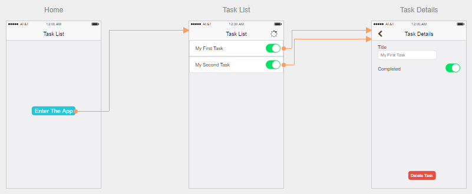

# Introduction

Welcome to the second edition of my book, "Develop Cloud Connected Mobile Apps with C# and Azure".  It's free, open-source, and (hopefully) comprehensive.  The first edition of the book covered three technologies - Xamarin Forms allowed you to develop cross-platform mobile apps in C# and .NET, whereas ASP.NET allowed you to develop backend mobile services when combined with Azure Mobile Apps.  Since I wrote the first edition of the book, all three technologies have been updated:

* Xamarin Forms is superceded by [.NET MAUI][maui].
* ASP.NET is superceded by [ASP.NET Core][aspnetcore].
* Azure Mobile Apps is superceded by the [Microsoft Datasync Framework][zumo], although it's mostly still called Azure Mobile Apps.

All three technologies, just like this book, are free, open-source, and provide comprehensive coverage for anything you may throw at them.  This book does not tell you everything there is to know about these technologies.  However, it focues on the topics necessary to get your mobile apps connected to a cloud-based backend.

## What are Cloud Connected Mobile Apps?

I guess I should define some of the terminology that I am going to use.  When I refer to a **mobile application** or **mobile app**, I mean every piece of software that is related to the application you want to use.  This includes, for example, the **mobile client**. This is the piece of code you run on your iPhone or Android phone.  It also includes the **mobile backend** which is the service that you run in the cloud to provide important services to your mobile client.

A **cloud connected mobile application** is a mobile client that connects to a mobile backend for shared services.  Quite a few of the apps on your phone are cloud connected already.  For example, Instagram uses the cloud for photo storage, and Facebook uses the cloud to store the news feeds of you and your friends.

## Why Cross-Platform Native Development is important?

It should come as no surprise that Apple and Google have pretty much won the mobile OS wars.  Over 90% of the smart phones being sold today run either iOS or Android.  However, these are two very different mobile operating systems, with different programming models.  iOS apps are written in [Swift](https://developer.apple.com/swift/), whereas Android apps are written in [Kotlin](https://developer.android.com/kotlin/).  If you want to develop for the 90% case (and you should), then you need to know both Swift and Kotlin.  That's a tall order even for the most dedicated mobile developer.

However, there are alternatives out there.  Most notable, you can write your mobile application with one code-base and just write exceptions for when the platforms diverge.  You have to pick a single language and a tool set that
supports cross-platform development to do this.  Not all cross-platform tool sets are created equal, however.  Some do not compile your code to native binaries, which means that you do not get access to all the functionality of the mobile platforms you are targeting.

[.NET MAUI][maui] (Multi-platform App UI, the successor to Xamarin Forms), allows you to target all major platforms - iOS, Android, macOS, and Windows - to gain greater than 95% coverage of the mobile smart phone and desktop market.  It does this by leveraging the .NET framework and compiling your code to a native binary for each platform.

## Why ASP.NET Core and the Microsoft Datasync Framework?

When you think about the major apps in the marketplace for each mobile platform, the thing that they have in common is that they have some sort of cloud infrastructure driving them.  It might be as simple as storing your task list, or as complex as your Facebook news feed.  It could be a gaming leader board, or the social sharing of your photos.  Whatever it is, cloud connectivity is a must.

[ASP.NET Core][aspnetcore] is a web framework for building web apps and services. It handles the basics of how to link a HTTP request to a piece of code that fulfills that request.  It's also got a highligh pluggable system for handling other things that may be needed - logging, authorization, and database access.  It is the de-facto standard for producing high quality web-based services.

However, it doesn't do everything for you.  The [Microsoft Datasync Framework][zumo] (also known as Azure Mobile Apps) provides a simplified mechanism to write offline-ready web APIs to deliver data to your app and capabilities to synchronize structured data between a client and service.

## Do I need Azure?

Mobile apps need to connect to a backend, and that isn't going to run on the PC under your desk.  These days, cloud services are used to host the backend web services, databases, and other services necessary to run a production mobile app backend.  As of writing, there are a number of clouds that can do this.  

Azure provides:

* Hosting for your mobile app backend ([Azure App Service](https://learn.microsoft.com/azure/app-service/overview), [Azure Container Apps](https://learn.microsoft.com/azure/container-apps/overview)).
* Database hosting that is "Entity Framework compatible" ([MySQL](https://learn.microsoft.com/azure/mysql/), [PostgreSQL](https://learn.microsoft.com/azure/postgresql/), [SQL Azure](https://learn.microsoft.com/azure/azure-sql)).
* Enterprise authentication services ([Azure Active Directory](https://learn.microsoft.com/azure/active-directory/fundamentals/active-directory-whatis)).
* File storage services ([Azure Storage](https://learn.microsoft.com/azure/storage/)).
* Push Notification services ([Azure Notification Hubs](https://learn.microsoft.com/azure/notification-hubs/notification-hubs-push-notification-overview)).
* Logging and monitoring services ([Azure Application Insights](https://learn.microsoft.com/azure/azure-monitor/app/app-insights-overview)).

Azure provides value-added services like machine learning, integration services, and video hosting.  These value added services provide capabilities that your mobile apps can utilize for a deeper experience for your users.  When you take your service to production, Azure also provides essential gateway services for security and observability of your backend service.

The combination of ASP.NET Core + Azure Mobile Apps can be run anywhere that can run ASP.NET Core codebases, including other cloud providers.  We'll be using Azure for this book because Azure supports .NET code better than anyone else.

## Who is This Book For?

This book is for intermediate to experienced C# developers who have already built a mobile app with Xamarin and want to take their mobile apps to the next level by utilizing cloud services.

This book is not for the beginner.  Explicitly, I already expect you to know how to develop mobile applications with C# and .NET MAUI.  If you are unfamiliar with the C# language, you can get started with a free course on the Internet.  The basics of the language can be learned at [Microsoft Learn](https://learn.microsoft.com/dotnet/csharp/). Once you have the language basics under your belt, you can move on to building mobile applications with .NET MAUI. You can learn more about developing cross-platform mobile development with .NET MAUI at the [.NET MAUI][maui] website.  Although you do not need to understand ASP.NET Core to get value out of this book, be aware that the mobile back ends that I will be covering are written in C# and ASP.NET Core.  A [good understanding of ASP.NET Core][aspnetcore] will assist you.

### Things You Should Know!

Before you get started with development, spend some time learning the tools of the trade.  The command prompt on the Mac is [zsh](https://linuxconfig.org/learn-the-basics-of-the-zsh-shell) and the command prompt on the PC is [PowerShell](https://learn.microsoft.com/training/modules/introduction-to-powershell/).  You should be proficient in the shell on the platforms that you use.

Additionally, you should become familiar with the source code control system that you will use.  For most, this means becoming familiar with[git](https://www.freecodecamp.org/news/learn-the-basics-of-git-in-under-10-minutes-da548267cc91/).  Don't even think of developing without using source control.

## What You Will Need

The list of hardware and software for mobile development is longer than your typical development projects.  It is still, thankfully, relatively short and easy to acquire.

### Hardware

You will want a computer on which to develop code.  If you develop iOS or macOS applications, then you **MUST** have a Mac running the latest version of Mac OSX.  If you develop Universal Windows applications, then you **MUST** have a PC running the latest version of Windows.  Android applications can be developed on either platform.

My own experience has taught me that the tooling for developing mobile backends in C# and ASP.NET (our primary languages during the course of this book) are better on a PC running Windows 10 or later.  Thus, my hardware choice is a Windows 10 PC for my main development system. In addition, I have a Mac Mini underneath my desk that I use to build the iOS portions of the applications.

### Software

All of the following software are freely available.  You should install each package and update it (if appropriate) so that it is fully patched.

#### On your Mac

* [XCode](https://developer.apple.com/xcode/resources/) (available on the Mac App Store)
* [Visual Studio 2022 for Mac](https://visualstudio.microsoft.com/vs/mac/).
* [Azure CLI][azurecli].

You must run XCode at least once after installation so that you can accept the license agreement.

#### On your Windows PC

* [Visual Studio 2022 Community (v17.4 or later)](https://visualstudio.microsoft.com/vs/)
* [Azure CLI][azurecli]

When installing Visual Studio, you will want to install the following workloads:

* ASP.NET and web development.
* Azure development.
* Data storage and processing.
* Mobile development with .NET.

If you have already installed Visual Studio and did not install these components, run the installer again to add the components.

!!! note
    You can use either Azure CLI or Azure PowerShell to assist in managing your Azure subscription.  I prefer using the Azure CLI because it operates the same way across all platforms.

### Cloud Services

You will need an Azure account to complete most of the tutorials in this book. In fact, you won't be able to get very far without one. If you have an MSDN account, you already have access to free Azure resources.  You just need to log into your [Visual Studio Subscriptions account](https://visualstudio.microsoft.com/subscriptions/) and activate your Azure benefit.  Students may be able to get access to [Azure for Students](https://azure.microsoft.com/free/students/) from school resources.  If you don't have MSDN, then there is a [free trial](https://azure.microsoft.com/free/) available. Once the trial period ends, you can move to a Pay-As-You-Go account and continue to use free services without incurring a charge. I'll point out when you are going to incur charges on your Azure account, but I will be using free resources most of the time.

Aside from Azure resources, you will want some place to store your code.  This doesn't have to be in the cloud.  If you want to use the cloud, you can use [GitHub](https://github.com/) or [Azure DevOps](https://azure.microsoft.com/products/devops) services.  Both are free to use.  I will be publishing all my samples and tutorial code on GitHub so that you can easily download it.  You don't have to use one of these resources, but I won't be covering other service usage.

You will need a **Developer Account** for the appropriate app store if you intend to distribute your mobile clients or if you intend to use specific cloud services:

* [Apple Developer Account](https://developer.apple.com/).
* [Google Developer Account](https://play.google.com/console/signup).
  
The terms of the accounts are changed constantly, so review the current terms when you sign up. At the time of writing, Android apps did not require a developer account for any functionality (although a developer account was required to distribute apps).  However, iOS and macOS apps require a developer account for a number of typical capabilities (including keychain access, which is normally required for authentication).  My recommendation is to defer signing up for these programs until you need something they offer.

## Build your first app

Now, let's get developing!  

There is a lot of detail to absorb about the possible services that the mobile client can consume and I will go into significant depth on those subjects. First, wouldn't it be nice to write some code and get something working?  Microsoft Azure has a great [first-steps tutorial](https://learn.microsoft.com/azure/developer/mobile-apps/azure-mobile-apps/quickstarts/maui/?pivots=vs2022-windows) that takes you via the quickest possible route from creating a mobile backend to having a functional backend.  I would like to take things a little slower so that we can understand what is going on while we are doing the process.  We will have practically the same application at the end.  The primary reason for going through this slowly is to ensure that all our build and run processes are set up properly.  If this is the first mobile app you have ever written, you will see that there are quite a few things that need to be set up.  

The application I am going to build is a simple task list.  The mobile client will have three screens - an entry screen, a task list and a task details page.  I have mocked these pages up using a screen mocking service.

!!! tip
    Mocking your screens before you start coding is a great habit to get into. There are some great tools available including free tools and ideas.  Doing mockups before you start coding is a good way to prevent wasted time later on.  For more tools, see the [tools](../tools.md) section of this book.

<figure markdown>

</figure>

!!! tip
    If you are using iOS, then you may want to remove the back button as the style guides suggest you don't need one.  Other platforms will need it though, so it's best to start with the least common denominator. 

My ideas for this app include:

* Tapping on a task title in the task list will bring up the details page.
* Toggling the completed link in the task list will set the completed flag.
* Tapping the spinner (or using pull to refresh) will initiate a network refresh.

Now that we have our client screens planned out, we can move onto the thinking about [the mobile backend](./mobile-backend.md).

<!-- Links -->
[maui]: https://learn.microsoft.com/dotnet/maui/what-is-maui
[aspnetcore]: https://learn.microsoft.com/aspnet/core/introduction-to-aspnet-core
[zumo]: https://learn.microsoft.com/azure/developer/mobile-apps/azure-mobile-apps/overview
[azurecli]: https://learn.microsoft.com/cli/azure/install-azure-cli
