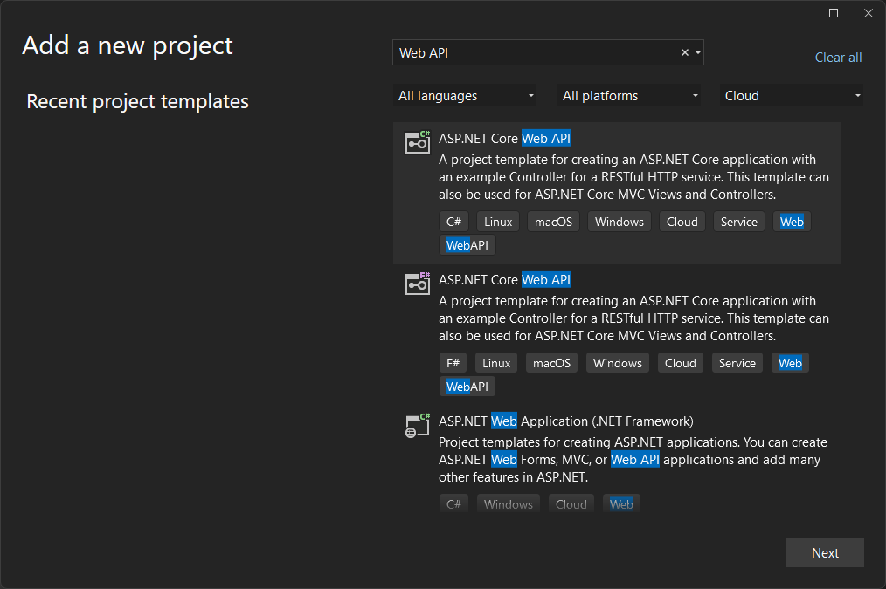
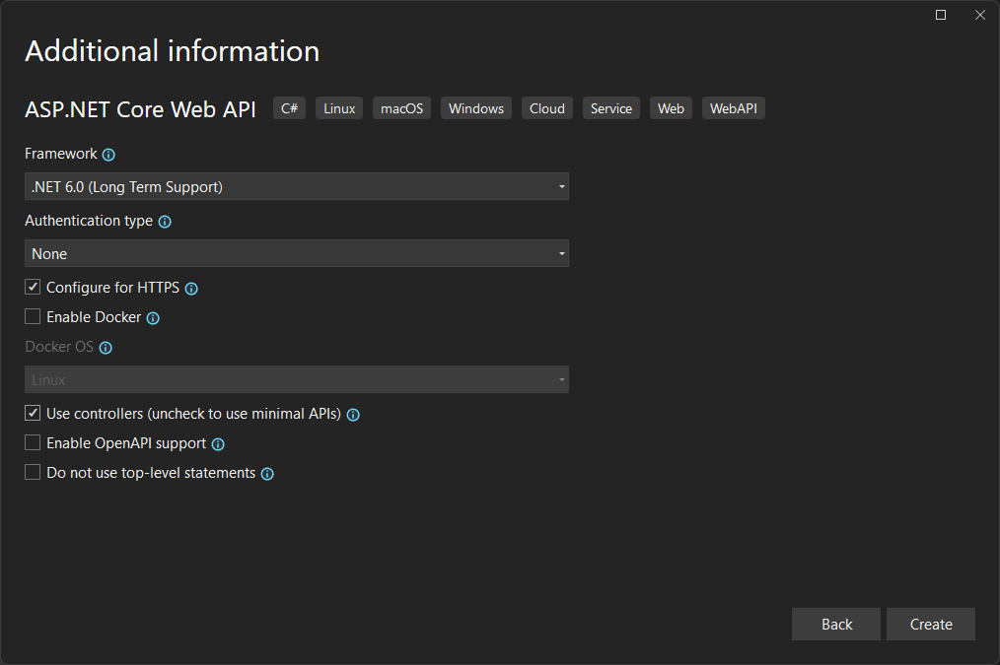
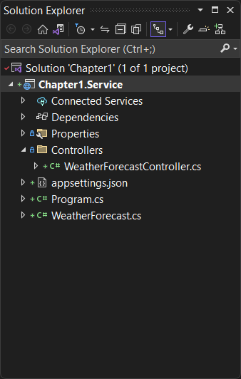

# Your first app - PC Edition

There is a lot of detail to absorb about the possible services that the mobile client can consume and I will go into significant depth on those subjects. First, wouldn't it be nice to write some code and get something working?  Microsoft Azure has a great [first-steps tutorial](https://learn.microsoft.com/azure/developer/mobile-apps/azure-mobile-apps/quickstarts/maui/?pivots=vs2022-windows) that takes you via the quickest possible route from creating a mobile backend to having a functional backend.  I would like to take things a little slower so that we can understand what is going on while we are doing the process.  We will have practically the same application at the end.  The primary reason for going through this slowly is to ensure that all our build and run processes are set up properly.  If this is the first mobile app you have ever written, you will see that there are quite a few things that need to be set up.  This chapter covers the set up required for a Windows PC.  If you wish to develop your applications on a Mac, then skip to the [next section](./mac-intro.md).

The application I am going to build is a simple task list.  The mobile client will have three screens - an entry screen, a task list and a task details page.  I have mocked these pages up using a screen mocking service.

!!! tip
    Mocking your screens before you start coding is a great habit to get into. There are some great tools available including free tools and ideas.  Doing mockups before you start coding is a good way to prevent wasted time later on.  For more tools, see the [tools](../tools.md) section of this book.

![Application Mockups for the Task List][img1]

!!! tip
    If you are using iOS, then you may want to remove the back button as the style guides suggest you don't need one.  Other platforms will need it though, so it's best to start with the least common denominator.  It's the same reason I add a refresh button even though it's only valid on Windows Phone!

My ideas for this app include:

* Tapping on a task title in the task list will bring up the details page.
* Toggling the completed link in the task list will set the completed flag.
* Tapping the spinner will initiate a network refresh.

Now that we have our client screens planned out, we can move onto the thinking about the mobile backend.

## Create a mobile backend

The mobile backend is an ASP.NET core web API that is served from within Azure App Service: a highly scalable and redundant web hosting service that supports all the major languages.  Azure Mobile Apps is an SDK that creates a mobile-ready web API in ASP.NET Core.  To create the mobile backend, we will use Visual Studio 2022 to create a new Web API project, then add Azure Mobile Apps to it.

### Create a new solution

First, create a new solution.  We'll use the solution to hold both the service project and the mobile app project we will create later.

=== "Command Line"

    Complete this task using the `dotnet` tool on the command line:

    ```powershell
    PS> mkdir -p \projects\Chapter1
    PS> cd \projects\Chapter1
    PS> dotnet new sln
    ```

    !!! tip
        Windows 10 and above have an in-built command line tool called [**Terminal**](https://learn.microsoft.com/windows/terminal/) that you can use to easily run command line tools.  Pin it to your task bar for quicker access.

=== "Visual Studio"

    Create an empty solution from the project selector:

    * Start Visual Studio 2022.
    * In the **Get started** section of the project selector, select **Create a new project**.
    * Use the search box to search for **Blank Solution**.
    * Enter `Chapter1` as the solution name, then press **Create**.

    !!! tip
        Android apps have a hard time with long filenames.  Create a location at the top of the filesystem (for example: `C:\projects`) to hold your mobile app projects so that you are less likely to run into problems later on.

### Create a new ASP.NET core service project

Next, create a Web API project:

=== "Command Line"

    Create an empty Web API project using the `dotnet` command line tool:

    ```powershell
    PS> dotnet new webapi --output Chapter1.Service
    PS> dotnet sln add Chapter1.Service
    ```

    Open the solution in Visual Studio by running `.\Chapter1.sln`, or by double-clicking the `Chapter1.sln` file in your file explorer.  You may be prompted to confirm which version of Visual Studio you wish to open.  Make sure you open Visual Studio 2022.

=== "Visual Studio"

    * Right-click on the `Chapter1` solution in the solution explorer.
    * Select **Add** > **New Project...**.
    * In the search box, enter _Web API_.
    * Select the C# **ASP.NET Core Web API**.

      <figure markdown>
        { width="50%" }
      </figure>

    * Press **Next**.
    * Enter the name `Chapter1.Service`, then press **Next**.
    * Check the **Use controllers** checkbox.

      <figure markdown>
        { width="50%" }
      </figure>

    * Press **Create**.

At this point, you should be running Visual Studio 2022 with the `Chapter1` solution loaded.  The solution should contain one project named `Chapter1.Service`.  The solution explorer should look like this:

<figure markdown>

</figure>

You can delete the `WeatherForecast.cs` model and `Controllers\WeatherForecastController.cs` classes as we will be replacing them very shortly.

### Add required libraries

The two most important libraries that we need to add are:

* [Entity Framework Core](https://learn.microsoft.com/ef/core/), which provides database access for our service.
* [Azure Mobile Apps](https://learn.microsoft.com/azure/developer/mobile-apps/azure-mobile-apps/overview), which provides the controller definitions for our mobile backend APIs.

=== "Command Line"

    Use the following command line:

    ```powershell
    PS> cd Chapter1.Service
    PS> dotnet add package Microsoft.EntityFrameworkCore.SqlServer
    PS> dotnet add package Microsoft.EntityFrameworkCore.Tools
    PS> dotnet add package Microsoft.AspNetCore.Datasync
    PS> dotnet add package Microsoft.AspNetCore.Datasync.EFCore
    ```

    These packages will allow you to produce mobile-ready web APIs that are backed by data in SQL Azure or SQL Server.  You could, for example, also use MySQL, PostgreSQL, or other relational databases without affecting this walk through.

=== "Visual Studio"

    * Select **Tools** > **NuGet Package Manager** > **Package Manager Console** to open the package manager console.
    * Ensure the default project is set to **Chapter1.Service**.
    * In the package manager console, enter the following:

    ```powershell
    PM> Install-Package Microsoft.EntityFrameworkCore.SqlServer
    PM> Install-Package Microsoft.EntityFrameworkCore.Tools
    PM> Install-Package Microsoft.AspNetCore.Datasync
    PM> Install-Package Microsoft.AspNetCore.Datasync.EFCore
    ```

    You can also use a visual style explorer to install the same packages by right-clicking on the `Chapter1.Service` project and selecting **Manage NuGet Packages...**.

### Configure database access

Entity Framework Core and ASP.NET Core are used extensively to provide database-driven web APIs.  Setting up Entity Framework Core is straight forward.  You need to:

* Define the database you will use in the application settings.
* Define a database context that describes the models and their relationships.
* Inject the database context into ASP.NET Core so that it is available to the service controllers.

Databases are defined by their [_Connection String_](https://www.connectionstrings.com/connection-strings-explained/) which describes how your application needs to connect to the database.  A connection string includes information about the database type, service address, and how to authenticate to the database.

ASP.NET Core application settings are kept in `appsettings.json` - a file you can see in your service project.  The value of the connection string in the `appsettings.json` file is only a default value and generally only used for local development.  When you deploy your service into a cloud environment, the connection string is over-ridden with the connection string for the cloud database.

Adjust the `appsettings.json` file to read the following:

```json linenums="1" title="appsettings.json" hl_lines="2-4"
{
  "ConnectionStrings": {
    "Database": "Server=(localdb)\\mssqllocaldb;Database=Chapter1;Trusted_Connection=True"
  },
  "Logging": {
    "LogLevel": {
      "Default": "Information",
      "Microsoft.AspNetCore": "Warning"
    }
  },
  "AllowedHosts": "*"
}
```

The new (highlighted) lines define the connection strings for the application.  I've explicitly selected a local SQL Server instance here, and a unique database name.

!!! note
    Visual Studio comes with a local SQL Server instance.

Next, let's create a database context, which is a class you write to define the models and relationships for the application.  Create a folder called `Database`, then create a new class called `AppDbContext.cs` in that folder:

```csharp linenums="1" title="AppDbContext.cs"
using Microsoft.EntityFrameworkCore;

namespace Chapter1.Service.Database
{
    public class AppDbContext : DbContext
    {
        public AppDbContext(DbContextOptions<AppDbContext> options) : base(options)
        {
        }

        public async Task InitializeDatabaseAsync()
        {
            await Database.EnsureCreatedAsync();
        }
    }
}
```

Technically, the `InitializeDatabaseAsync()` method is not required.  However, I find it useful during development to wipe the database and re-start from scratch.  The `InitializeDatabaseAsync()` method will be called during service startup to ensure that we have the appropriate tables created.

!!! tip
    In a production environment, you can use the `InitializeDatabaseAsync()` method to automatically apply [migrations](https://learn.microsoft.com/ef/core/managing-schemas/migrations) that update the database to the latest requirements of your service.  We'll be talking more about migrations in chapter 3.

Now, let us turn our attention to setting up the service. The service entry-point is `Program.cs`, and this file is responsible for wiring all our settings into the service.  Here is the newest `Program.cs` with the associated changed lines highlighted:

```csharp linenums="1" title="Program.cs" hl_lines="1-2 5-11 15-19"
using Chapter1.Service.Database;
using Microsoft.EntityFrameworkCore;

var builder = WebApplication.CreateBuilder(args);
var connectionString = builder.Configuration.GetConnectionString("Database");
if (connectionString == null)
{
    throw new ApplicationException("Database connection string is not set.");
}

builder.Services.AddDbContext<AppDbContext>(options => options.UseSqlServer(connectionString));
builder.Services.AddControllers();

var app = builder.Build();
using (var scope = app.Services.CreateScope())
{
    var context = scope.ServiceProvider.GetRequiredService<AppDbContext>();
    await context.InitializeDatabaseAsync();
}

app.UseHttpsRedirection();
app.UseAuthorization();
app.MapControllers();

app.Run();
```

The second highlighted block reads the connection string from our `appsettings.json` file and injects a database context based on our `AppDbContext` class into the services for our ASP.NET Core application.  The third highlighted block initializes our database before the service starts listening for connections.

### Configure Azure Mobile Apps

Adding Azure Mobile Apps to an ASP.NET Core application involves three required steps:

* Enable datasync controllers in the ASP.NET Core startup file.
* Add a datasync-compatible model (also known as a _Data Transfer Object_ or _DTO_) to the Entity Framework Core database context.
* Create a datasync-compatible Web API controller for the model.

To start with, let's enable datasync controllers in the `Program.cs` file.  This is easily the easiest part of the whole journey.  You need to replace the call to `AddControllers()` with one to `AddDatasyncControllers()`:

```csharp linenums="1" title="Program.cs" hl_lines="2 13"
using Chapter1.Service.Database;
using Microsoft.AspNetCore.Datasync;
using Microsoft.EntityFrameworkCore;

var builder = WebApplication.CreateBuilder(args);
var connectionString = builder.Configuration.GetConnectionString("Database");
if (connectionString == null)
{
    throw new ApplicationException("Database connection string is not set.");
}

builder.Services.AddDbContext<AppDbContext>(options => options.UseSqlServer(connectionString));
builder.Services.AddDatasyncControllers();

var app = builder.Build();
using (var scope = app.Services.CreateScope())
{
    var context = scope.ServiceProvider.GetRequiredService<AppDbContext>();
    await context.InitializeDatabaseAsync();
}

app.UseHttpsRedirection();
app.UseAuthorization();
app.MapControllers();

app.Run();
```

Next, we need to create a model.  I use a naming scheme that ends in `DTO` to ensure I am reminded visually that I am talking about a model that is transmitted to the remote client.  In this case, I have `Models\TaskItemDTO.cs`:

```csharp linenums="1" title="TaskItemDTO.cs"
using Microsoft.AspNetCore.Datasync.EFCore;
using System.ComponentModel.DataAnnotations;

namespace Chapter1.Service.Models
{
    public class TaskItemDTO : EntityTableData
    {
        [Required, MinLength(1)]
        public string Title { get; set; } = string.Empty;

        public bool IsComplete { get; set; } = false;
    }
}
```

The big things to note here are:

* A DTO **always** implements `ITableData`.  Each type of datasync repository implements a version of `ITableData` and you **must** inherit from this implementation when creating a DTO.
* The implementation of `ITableData` for Entity Framework Core is called `EntityTableData`.
* You can optionally use data annotations to describe your model requirements.  These are checked whenever a change to an entity is made (such as creating a new item or updating an item).  

`ITableData` includes the following fields:

* `Id` - a globally unique ID for the entity.
* `Deleted` - a boolean value that indicates if the entity has been deleted.
* `UpdatedAt` - an ISO-8601 date/time value that provides the date that the entity was last updated.
* `Version` - an opaque value that changes on every write.

You should never have to deal with these values when using Azure Mobile Apps, and should consider them read-only in your own code.

We also need to add the `TaskItemDTO` to the `AppDbContext` so that Entity Framework Core can create the table backing this data:

```csharp linenums="1" title="AppDbContext.cs" hl_lines="1 12"
using Chapter1.Service.Models;
using Microsoft.EntityFrameworkCore;

namespace Chapter1.Service.Database
{
    public class AppDbContext : DbContext
    {
        public AppDbContext(DbContextOptions<AppDbContext> options) : base(options)
        {
        }

        public DbSet<TaskItemDTO> TaskItems => Set<TaskItemDTO>();

        public async Task InitializeDatabaseAsync()
        {
            await Database.EnsureCreatedAsync();
        }
    }
```

Finally, we need to create a controller.  By default, the controller can have any route, but the Datasync Framework client libraries default to the model name under `/tables`.  On our client, we want our model to be called `TaskItem`, so I'll set the route to `/tables/taskitem`.

```csharp linenums="1" title="Controllers\TaskItemController.cs"
using Chapter1.Service.Database;
using Chapter1.Service.Models;
using Microsoft.AspNetCore.Datasync;
using Microsoft.AspNetCore.Datasync.EFCore;
using Microsoft.AspNetCore.Mvc;

namespace Chapter1.Service.Controllers
{
    [Route("tables/taskitem")]
    public class TaskItemController : TableController<TaskItemDTO>
    {
        public TaskItemController(AppDbContext context) : base()
        {
            Repository = new EntityTableRepository<TaskItemDTO>(context);
        }
    }
}
```

The three things you **must** do in a datasync controller:

* Inherit from `TableController<T>`.
* Set the route that is used as the base URI for requesting data.
* Set the repository that is used to access and store the data in the database.

The repository is a standard pattern in service development that provides mechanisms for retrieving, creating, updating, and deleting entities in the database.

<!-- Images -->
[img1]: assets/mockingbot.png

